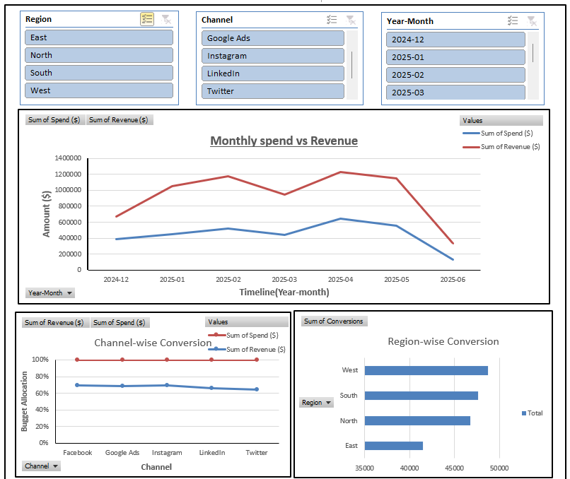
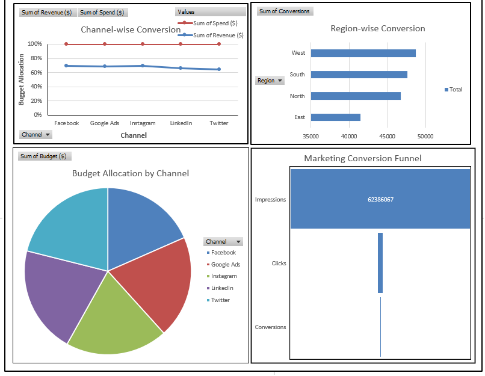

# Marketing Campaign Analysis

An interactive marketing performance dashboard built to track **spend, revenue, conversions, and channel ROI** across regions and time. The workbook helps marketing and business teams understand where budget is going, which channels convert best, and how the funnel behaves from impressions to conversions.

---

## Project overview

Modern marketing teams run campaigns across multiple platforms (Google Ads, Facebook, Instagram, LinkedIn, Twitter) and regions. Without a clear view of performance, it is hard to decide where to invest next.

This project brings that data into a single visual dashboard so stakeholders can:

- Compare **monthly spend vs revenue** and spot ROI trends
- Evaluate **channel-wise** and **region-wise** conversion performance
- See how the **marketing budget is allocated** across channels
- Analyze the **conversion funnel** from impressions → clicks → conversions
- Filter insights by **Region**, **Channel**, and **Year-Month** using interactive slicers

---

## Dashboard screenshots

### Dashboard 1 — Spend, revenue & conversion overview

This page focuses on overall campaign health: trends over time, channel efficiency, and regional conversions.



**What this page shows**

| Visual | Description |
|--------|-------------|
| **Slicers (Region, Channel, Year-Month)** | Interactive filters to slice the dashboard by geography, marketing platform, and time period |
| **Monthly spend vs Revenue** | Line chart comparing total spend (blue) and total revenue (red) from Dec 2024 to Jun 2025. Revenue stays consistently above spend, with a strong peak around April 2025 |
| **Channel-wise Conversion** | Line chart comparing spend and revenue contribution across Facebook, Google Ads, Instagram, LinkedIn, and Twitter |
| **Region-wise Conversion** | Horizontal bar chart of conversions by region — **West** leads, followed by South and North, while **East** has the lowest conversions |

**Key takeaways from this view**

- Revenue tracks above spend throughout the period, indicating positive campaign returns
- Performance peaks in early–mid 2025, then softens toward June
- West is the strongest converting region; East is the main opportunity area

---

### Dashboard 2 — Channel mix, budget & funnel deep dive

This page breaks down channel performance, budget distribution, and the end-to-end marketing funnel.



**What this page shows**

| Visual | Description |
|--------|-------------|
| **Channel-wise Conversion** | Spend vs revenue view by channel to compare efficiency across platforms |
| **Region-wise Conversion** | Conversion volume by West, South, North, and East |
| **Budget Allocation by Channel** | Pie chart showing how marketing budget is split across Facebook, Google Ads, Instagram, LinkedIn, and Twitter — investment is relatively balanced across channels |
| **Marketing Conversion Funnel** | Funnel from **Impressions (62.3M+)** → **Clicks** → **Conversions**, highlighting drop-off at each stage of the customer journey |

**Key takeaways from this view**

- Budget is spread fairly evenly across the five channels
- The funnel shows very large top-of-funnel reach (impressions), with sharp drop-offs at clicks and conversions — a useful lens for optimizing CTR and conversion rate
- West remains the top region for conversions across both dashboard pages

---

## Business questions answered

1. **Are campaigns profitable?** — Spend vs revenue trends show whether ROI is healthy over time.
2. **Which channel deserves more budget?** — Channel conversion and budget allocation views support reallocation decisions.
3. **Which region is performing best?** — Region-wise conversion highlights leaders and lagging markets.
4. **Where do users drop off?** — The marketing funnel shows the gap between impressions, clicks, and conversions.
5. **How does performance change over months?** — Year-Month filters and the monthly trend chart support time-based analysis.

---

## Tech stack & skills demonstrated

- **Microsoft Excel / Power BI** dashboard design
- Interactive **slicers** for Region, Channel, and Year-Month
- Chart types: **line charts**, **bar charts**, **pie chart**, and **funnel chart**
- Marketing KPIs: Spend, Revenue, Conversions, Impressions, Clicks, Budget Allocation
- Data storytelling for marketing and business stakeholders

---

## Repository files

| File | Description |
|------|-------------|
| `Marketing_Campaign_Dashboard.xlsx` | Main dashboard workbook |
| `image.png` | Screenshot — spend, revenue & conversion overview |
| `image2.png` | Screenshot — channel mix, budget & funnel |
| `README.md` | Project documentation |

---

## How to open & use

1. Clone or download this repository:
   ```bash
   git clone https://github.com/EktaJaiswal-lab/Marketing_Campaign_Analysis.git
   ```
2. Open `Marketing_Campaign_Dashboard.xlsx` in **Microsoft Excel** (or import into **Power BI Desktop**).
3. Use the **Region**, **Channel**, and **Year-Month** slicers to filter the visuals.
4. Explore both dashboard pages to review trends, channel mix, regional performance, and the conversion funnel.

---

## Author

**Ekta Jaiswal**  
GitHub: [EktaJaiswal-lab](https://github.com/EktaJaiswal-lab)

---

*Portfolio project — Marketing Campaign Analysis Dashboard*
